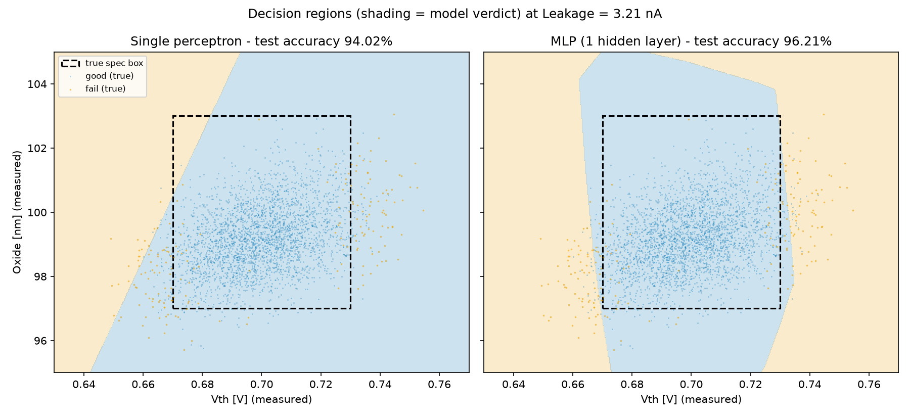

# wafer_test

반도체 웨이퍼 공정 시뮬레이터와, 그 데이터를 학습해 EDS처럼 양품/불량을 스스로
판정하는 머신러닝 분류기. 시뮬레이터부터 퍼셉트론·MLP까지 전부 numpy로 밑바닥부터
구현했습니다.

## 핵심 스토리

1. **가상 fab** — 실행할 때마다 공정 조건(Vth/Oxide/Leakage의 중심·산포)이 범위
   안에서 자동 샘플링되고, 물리 상관관계(Oxide 두께 → Vth, Leakage)가 반영된
   웨이퍼 2만 장이 생성됩니다.
2. **현실적인 라벨** — 양불 판정(Result)은 **참값** 기준으로 내려지지만, 데이터에
   저장되는 것은 **측정값(참값 + 센서 노이즈)**입니다. 스펙 경계 근처에서는 측정만
   으로 양불을 확정할 수 없으므로, 어떤 모델도 100%에 도달할 수 없는 진짜 확률적
   분류 문제가 됩니다.
3. **단층 퍼셉트론의 한계** — 양품 영역은 스펙 박스(구간 AND)인데 퍼셉트론은 직선
   하나만 그을 수 있어 원리적으로 이 문제를 못 풉니다. 학습 중 오분류 수정 횟수가
   끝까지 줄지 않는 것(비수렴)으로 이를 실험적으로 확인했습니다.
4. **MLP로 돌파** — 은닉 뉴런들이 스펙 경계를 하나씩 학습하고 출력 뉴런이 이를
   조합해 박스를 표현합니다. 역전파까지 numpy로 직접 구현했습니다.

## 결과

평가는 **run 단위 분리**(학습 8 run / 테스트 2 run)로, 학습 때 본 적 없는 공정
조건에 대한 일반화 성능을 측정합니다. 데이터: 10 run × 20,000 = 200,000 웨이퍼.

| 지표 (불량 = positive) | 단층 퍼셉트론 (pocket) | MLP (은닉 16) |
|---|---|---|
| Test 정확도 | 94.02% | **96.21%** |
| Precision | 84.81% | 72.10% |
| Recall | **12.56%** | **70.43%** |
| F1 | 21.87% | **71.26%** |

("전부 양품" 베이스라인 정확도 93.33% — 불균형 데이터라 정확도만으로는 판단 불가)

퍼셉트론은 정확도만 보면 그럴듯하지만 **불량의 87%를 놓칩니다**. 직선 하나로는
"가운데 구간만 양품"을 표현할 수 없기 때문입니다. 아래 그림이 그 이유를 보여줍니다:



왼쪽(퍼셉트론)은 평면을 대각선으로 자를 뿐이라 오른쪽 위의 불량들을 전부 양품
판정하는 반면, 오른쪽(MLP)은 실제 스펙 박스(점선)에 가까운 닫힌 영역을 학습했습니다.

MLP는 P(양품)를 출력하므로 판정 컷오프를 조절해 운영점을 고를 수 있습니다.
불량 유출이 치명적인 fab이라면 컷오프를 올려 recall을 우선합니다:

| cutoff | precision(fail) | recall(fail) | F1 |
|---|---|---|---|
| 0.1 | 93.27% | 36.36% | 52.32% |
| 0.5 | 72.10% | 70.43% | 71.26% |
| 0.9 | 43.42% | **93.48%** | 59.30% |

## 구조

```
wafer_test/
├── main.py                     # 시뮬레이션 엔트리포인트
├── simulation/                 # 가상 fab (데이터 생성)
│   ├── config.py               # 공정 스펙, 샘플링 범위, 측정 노이즈
│   ├── config_sampler.py       # run마다 공정 조건 자동 샘플링 (seed 기록)
│   ├── wafer_generate.py       # 웨이퍼 물리량 생성 + 측정 노이즈
│   ├── wafer_analysis.py       # 스펙 판정 → 수율
│   ├── defect_analysis.py      # 불량 원인별 집계
│   ├── visualization.py        # 분포/파레토 차트
│   ├── correlation_analysis.py # 상관 분석/산점도
│   ├── run_logger.py           # run_info.json + wafers.csv.gz 저장
│   └── run_manage.py           # run 폴더 관리 (run_001, run_002, ...)
├── ml/                         # 머신러닝 (numpy 밑바닥 구현)
│   ├── dataset.py              # run 취합 로더, run 단위 train/test 분리
│   ├── perceptron.py           # 단층 퍼셉트론 + pocket 알고리즘
│   ├── mlp.py                  # MLP + 역전파 + 가중 손실 + 모델 저장
│   ├── judge.py                # 저장된 모델로 새 run 판정 (EDS 단계)
│   └── visualize_boundary.py   # 결정 경계 vs 실제 스펙 박스 시각화
└── graph/                      # 실행 결과물 (gitignore)
    └── run_XXX/                # run별 그래프, run_info.json, wafers.csv.gz
```

## 실행

```bash
# 1) 데이터 생성 - 돌릴 때마다 새로운 공정 조건으로 2만 장씩 축적
python3 main.py

# 2) 쌓인 데이터 현황
python3 ml/dataset.py

# 3) 학습/평가 (mlp.py는 학습된 모델을 graph/ml/mlp_model.npz로 저장)
python3 ml/perceptron.py
python3 ml/mlp.py

# 4) 학습된 모델로 새 웨이퍼 lot 판정 (EDS 단계)
python3 main.py                  # 새 run 생성 (예: run_011)
python3 ml/judge.py run_011      # 저장된 모델이 판정, 규칙 정답과 비교
python3 ml/judge.py run_011 0.9  # 컷오프를 올려 recall 우선 운영

# 5) 결정 경계 그림 생성 (graph/ml/decision_boundary.png)
python3 ml/visualize_boundary.py
```

## 비용 비대칭 반영 (가중 손실)

불량 유출(FN)이 양품 폐기(FP)보다 비싼 fab을 위해, 손실 함수에서 불량 샘플에
가중치를 줍니다 (`MLP(fail_weight=5)`). 학습 자체가 불량에 신중해져서, 같은 컷오프
0.5에서 불량 recall이 70% → 89%로 오릅니다 (precision을 내주는 의도된 트레이드오프).
추론 시점의 컷오프까지 합쳐 운영점을 정하는 손잡이가 둘이 됩니다.

## 다음 계획

- PyTorch 재구현과 numpy 구현 비교
- 파라미터 추가 (CD, 온도 등)로 특징 공간 확장
