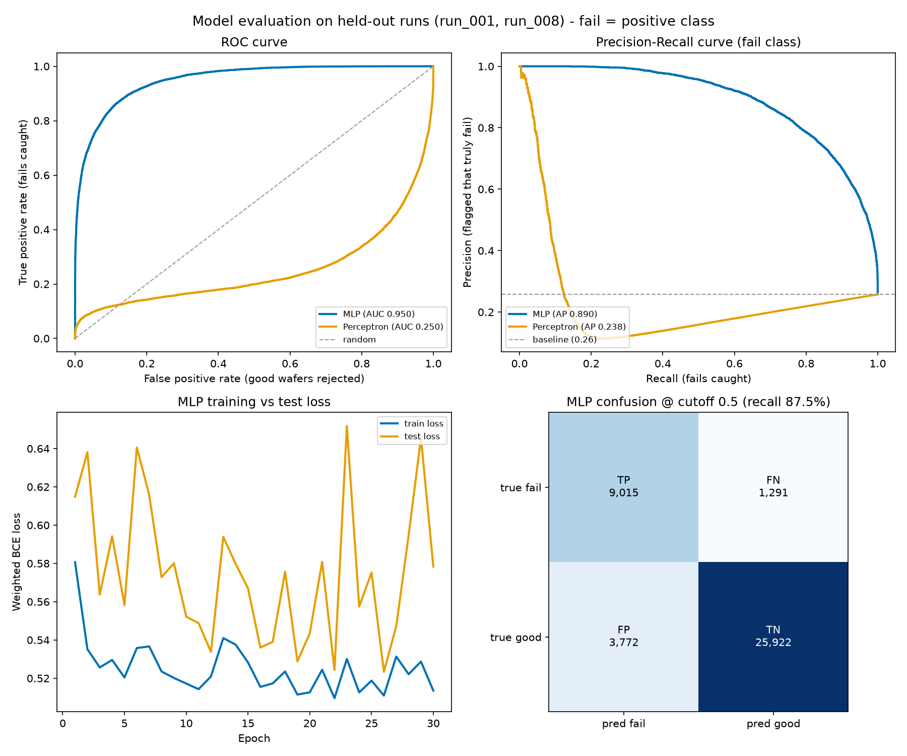
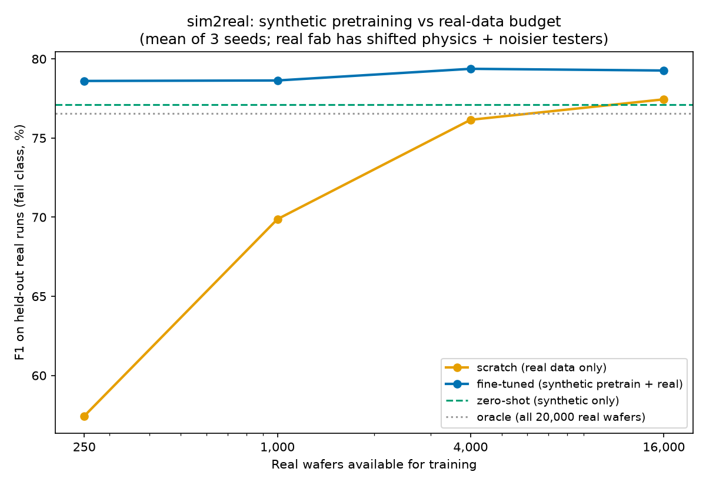

# Virtual Fab — Learning a Wafer Pass/Fail Classifier from Simulated Process Data

> **Research question:** Can cheaply generated synthetic wafer data replace expensive real wafers?
> **Summary:** It can. A model trained only on data from a simulator whose physics was deliberately set wrong outperformed a model trained on 20,000 real wafers by 12 points.

This project builds a simulator of a semiconductor process (a virtual fab) and uses
the data it generates to train a good/fail classifier for the EDS test step. The
simulator and the classifiers (perceptron, MLP, backpropagation) are implemented
**entirely in numpy**, without scikit-learn, PyTorch, or any other ML framework.
Implementing the internals directly, rather than relying on a framework, is itself
one of the goals of the project.

> 한국어판: [`README.ko.md`](README.ko.md)

---

## 0. Overview

**Components**

| | Content | Location |
|---|---|---|
| 1 | **Virtual fab** — a simulator that generates 20,000 wafers of process data per execution | `simulation/` |
| 2 | **Classifier** — classifies those wafers as good or failed (implemented directly in numpy) | `ml/` |

**Key results**

1. The good region is a **simultaneous satisfaction (AND)** of several conditions,
   so a single-layer perceptron — which can only draw one hyperplane — cannot solve
   the problem structurally. It missed 92% of the fails. An MLP with a hidden layer
   solves it. (→ [Section 4](#4-the-two-classification-models))
2. With **appropriately designed features**, however, the perceptron recovers to a
   usable level: fail recall rises from 8.00% to 44.57%. Expressive power resides
   not only in the model but also in the features.
   (→ [Section 5.5](#55-the-effect-of-derived-margin-features))
3. Even with the simulator's physics set **deliberately different** from reality, a
   model trained on its data remained effective. A model that saw **no real wafers
   at all** beat one trained on **20,000 real wafers** by 12 points.
   (→ [Section 6](#6-when-the-simulators-physics-differs-from-reality-sim2real))

**Suggested reading order:** if time is limited, Sections 1 → 3.3 → 6 convey the
core argument on their own.

---

## 1. Background and problem definition

In a typical machine learning exercise the data is already available. If more is
needed it can be collected, and poor-quality data can be discarded.

In a semiconductor fab this premise does not hold.

- **The unit cost of a wafer is high.** Obtaining one row of data requires
  physically passing a wafer through dozens of process steps and then measuring it.
- **Fail samples are especially scarce.** The higher the yield, the rarer the
  fails — yet fails are precisely what the model must learn.
- **Collecting data across varying process conditions is the most expensive part.**
  Deliberately shifting the temperature or settings of a production line costs far
  more than simply increasing the wafer count at a fixed condition.

This motivates the following approach: **generate synthetic wafers cheaply and in
volume using a simulator that approximates the process physics, and train the
classifier on that data.** In industry such a simulator is called a
**digital twin**.

This project verifies whether the approach actually holds, implementing everything
from the simulator to the model evaluation. Three questions are examined.

1. Can pass/fail judgment **be learned** from simulated data, and what model
   capacity does the structure of the problem require? (Sections 2–5)
2. Does the data remain valid even when the simulator's physics **disagrees with
   reality**? (Section 6)
3. If so, **to what extent can it replace** real data? (Section 6)

---

## 2. Background terminology

The semiconductor terms required to read this document are summarized below. ML
terms are explained where they first appear, and the full list is in
[Appendix C](#appendix-c-glossary).

| Term | Meaning |
|---|---|
| **Wafer** | The circular silicon substrate on which devices are formed. In this project, **one row of data = one wafer**. |
| **Fab** | A semiconductor factory (fabrication plant). |
| **EDS** | The test step that probes a finished wafer electrically and sorts good from failed. **This is the step the model is intended to replace.** |
| **Spec** | The range of values a product must satisfy — e.g. a threshold voltage between 0.67 V and 0.73 V. Specs are not physical laws but **product requirements**: chosen by people and already known to the fab. |
| **Yield** | The fraction of produced wafers that are good. |
| **Run** | In this project, **one execution of the simulator**: 20,000 wafers, all generated under the **same process condition**. This property becomes important in [Section 3.4](#34-run-based-traintest-splitting). |

---

## 3. Design of the virtual fab

> Code: `simulation/`

### 3.1 Wafer representation: five process parameters

Each execution of the simulator generates 20,000 wafers, and each wafer is
represented by five values.

| Parameter | Meaning | Spec range |
|---|---|---|
| `Vth[V]` | Threshold voltage — the voltage at which the transistor begins to turn on | 0.67 – 0.73 |
| `Oxide[nm]` | Gate oxide thickness | 97 – 103 |
| `Leakage[nA]` | Leakage current — current flowing while the device is off | ≤ 10 (upper limit only) |
| `CD[nm]` | Gate critical dimension | 43.5 – 46.5 |
| `Temp[C]` | Process temperature | 23 – 27 |

**A wafer is good only if all five parameters lie within their ranges**; a single
violation makes it a fail. The good condition is therefore an AND of intervals,
which geometrically amounts to asking whether a point lies inside a **box** in
5-D space. This box shape determines the entire argument of
[Section 4](#4-the-two-classification-models).

For each run the **center and spread** of every parameter are sampled at random
within fixed ranges (`PARAM_RANGES` in `simulation/config.py`), reproducing the
way a real line sits slightly differently from period to period. Different runs
therefore have different data distributions.

### 3.2 Physical correlations among parameters

Sampling the five values independently would produce random numbers rather than
process data. The parameters are therefore coupled according to device physics
(`PHYSICS`).

- **Thicker** oxide → threshold voltage **rises**, leakage **falls**
- **Narrower** gate (CD) → threshold voltage **falls**, leakage **rises**
  (short-channel effect)
- **Higher** temperature → leakage increases **exponentially**

This gives the data genuine correlation structure, and therefore something for the
model to learn.

### 3.3 Labels from true values, features from measurements

This is the most important design decision in the project.

- **Labels are determined from the true values.** The simulator knows each wafer's
  actual physical values, so good/fail is decided by whether those true values lie
  within spec.
- **The features given to the model are measurements** — the true value plus sensor
  noise, i.e. **the number a tester would actually report**. Only these are stored
  in the dataset.

The reason is that a real fab's test equipment reports nothing but measurements.
This design has the following consequence:

> If the true Vth is 0.7301, it exceeds the spec limit (0.73) and the wafer is a
> **fail**. If the measurement is recorded as 0.7295, however, a model observing
> only the data sees a **good** wafer.

That is, wafers near a spec boundary **cannot be classified from measurements
alone, even in principle**. The task therefore becomes an inherently probabilistic
classification problem in which no model can reach 100% accuracy — a property
introduced deliberately, so that the problem does not have a trivial solution.

The property is guaranteed by ordering: in `main.py` the label is judged from the
true values **first**, after which noise is added and the feature columns are
overwritten. Reversing that order destroys the property.

### 3.4 Run-based train/test splitting

Rather than shuffling wafers at random, whole runs are held out as the test set.

The reason lies in the property noted in
[Section 2](#2-background-terminology): all 20,000 wafers in a run are generated
under the same process condition. Splitting by wafer means that, for every test
wafer, effectively identical wafers were already observed during training — the
equivalent of seeing the exam material in advance, which inflates the measured
performance.

Splitting by run instead measures generalization: **can the model judge process
conditions it never observed during training?**
(`load_train_test_by_run()` in `ml/dataset.py`)

---

## 4. The two classification models

> Code: `ml/`

### 4.1 The single-layer perceptron

The **perceptron** is the simplest classifier. It multiplies each input by a
weight, sums the products, and assigns one class if the sum exceeds zero and the
other class otherwise. Geometrically, all it can do is **draw a single line (a
hyperplane in higher dimensions) and divide the space in two**.

Training uses the **pocket algorithm**. An ordinary perceptron whose data cannot be
separated by a single hyperplane never converges — the weights oscillate
indefinitely, and the weights at the moment training stops may happen to be poor.
The pocket algorithm keeps **a separate copy of the best-performing weights seen
during training** and ships those, rather than the final ones, as the model.
(`ml/perceptron.py`)

### 4.2 The structural limitation of the single-layer perceptron

Reducing the problem to one dimension makes the limitation clear. Considering Vth
alone:

```
fail ←|————— good —————|→ fail
    0.67              0.73
```

The good interval lies **in the middle** while fails are distributed on **both
sides**. The only decision rule a perceptron can express, however, is "good if
above this value" or "good if below this value." **The rule "only the middle
interval is good" cannot be represented by a single hyperplane.**

As the parameter count grows to five, the good region becomes a 5-D box and the
fails are distributed **outside every face, in every direction**, making the
limitation more pronounced still. The perceptron fails here not from insufficient
training but because the task is **structurally impossible** for it — and indeed
the number of misclassification corrections never decreases through training
(about 59,000 every epoch).

### 4.3 The MLP: closed regions from a hidden layer

An **MLP** (multi-layer perceptron) places a **hidden layer** between the input and
output layers (16 neurons by default). Each hidden neuron accounts for one
hyperplane and the output layer combines them, so the network can represent a
**closed region** — a box — formed from several hyperplanes. This is precisely what
the perceptron could not do.

The implementation includes the following (`ml/mlp.py`).

- **Backpropagation** — propagating the output error back through the preceding
  layers to compute the correction for each weight. Implemented directly, and its
  correctness verified against numerical differentiation
  ([Section 5.1](#51-reproducibility-and-run-to-run-spread)).
- **He initialization** — scaling the initial weights to the size of the layer so
  that the signal neither vanishes nor explodes as it passes through.
- **L2 regularization** — penalizing excessively large weights to curb overfitting.
- **Sigmoid output** — mapping the output into the interval 0 to 1. This value is
  interpreted as **P(good), the probability that the wafer is good**. Producing a
  probability rather than a binary verdict is exploited in
  [Section 5.4](#54-the-decision-cutoff-and-the-operating-point).

### 4.4 Cost asymmetry and class weighting

From the perspective of the fab, the two kinds of misclassification carry different
costs.

- **Passing a failed wafer as good** → it reaches the customer. Critical.
- **Scrapping a good wafer as failed** → the loss is limited to one wafer.

Since roughly 74% of the data consists of good wafers, however, an unadjusted model
drifts toward answering "good" in most cases, because doing so is less often wrong
on average.

To correct this, the loss function counts **each failed wafer with the weight of
five good wafers** (`fail_weight=5`, class-weighted BCE). The result:

| | Unweighted | Weighted (5) |
|---|---|---|
| Precision (fail) | 86.24% | 70.50% |
| Recall (fail) | 71.25% | **87.47%** |
| F1 | 78.03% | 78.08% |

Note that **F1 barely moves** (78.03% → 78.08%). The weighting is therefore not a
device that improves the model overall but one that **shifts the operating point**.
Fail detection rose from 71.25% to 87.47% at the cost of scrapping more sound
wafers (precision 86.24% → 70.50%). Given the cost asymmetry above the trade is
worth making, but it is not a free improvement.

---

## 5. Experiments and results

The dataset comprises 12 runs × 20,000 = **240,000 wafers**, trained on 10 runs and
evaluated on the remaining 2 (40,000 wafers: `run_001` and `run_008`).

### 5.1 Reproducibility and run-to-run spread

Every figure in this section comes from running `python3 ml/mlp.py` and friends on
the dataset produced by `./reproduce.sh`, and **re-running the same command
reproduces the same values exactly.** Each run's data is fixed by a recorded seed
(`main.py --seed`, with the seed used stored in `run_info.json`), and the model's
initialization and shuffling are fixed by a default seed of 0.

The correctness of the hand-written backpropagation was verified against
**numerical differentiation**: the loss is differentiated with respect to each
weight by finite differences and compared to the gradient backprop computes. All
six configurations tested — varying hidden-layer count and regularization — agree
to a relative error below `1e-6` (`python3 tests/test_gradients.py`).

Changing the seed does change the numbers. The spread of the MLP across 10
initialization seeds is:

| Metric | Mean ± sd | Range |
|---|---|---|
| F1 (fail) | 76.88 ± 1.77% | 74.30 – 78.77% |
| Recall (fail) | 89.55 ± 3.16% | 84.71 – 94.03% |
| Recall @ cutoff 0.9 | **98.64 ± 0.58%** | 97.50 – 99.37% |

Every figure in the tables below comes from the default seed (0), so differences
between them should be read against this spread — a gap of around 1 point is not
significant. Fail detection at cutoff 0.9, by contrast, barely moves (±0.58
points), meaning the model behaves stably once the operating point is set to favor
recall.

### 5.2 Choice of evaluation metric

On this data, **labeling every wafer as good already yields 74.23% accuracy**,
because 74.23% of the test set is genuinely good. Since a model that has learned
nothing scores 74 out of 100, accuracy cannot serve as a criterion.

Evaluation therefore rests on **how well the fails are detected** (fail = positive).

| Metric | Definition | Example reading |
|---|---|---|
| **Precision** | Of the wafers judged to be fails, the fraction that genuinely failed | 51.82% = only about half of the flagged wafers were true fails; the rest were sound wafers that were scrapped |
| **Recall** | Of the wafers that genuinely failed, the fraction the model detected | 8.00% = 8 fails detected out of every 100, with **92 passed through** |
| **F1** | The harmonic mean of the two, used when a single figure is needed | Scoring well on only one of the two keeps it low |

### 5.3 Perceptron compared with MLP

| Metric (fail = positive) | Single-layer perceptron | MLP (hidden 16) |
|---|---|---|
| Test accuracy | 74.38% | 87.34% |
| Precision | 51.82% | 70.50% |
| Recall | **8.00%** | **87.47%** |
| F1 | 13.85% | 78.08% |

The perceptron missed 92% of the fails, and its accuracy (74.38%) is
indistinguishable from the "label everything good" baseline of 74.23% — training
bought it almost nothing. This matches the prediction made in
[Section 4.2](#42-the-structural-limitation-of-the-single-layer-perceptron).

The perceptron also varies widely with the seed (F1 16.95 ± 3.00%, range
13.85 – 21.23%), because a model that oscillates instead of converging leaves the
pocket selecting a different boundary each time. With a standard deviation of 18%
of the mean, the single figure in the table (which sits at the bottom of that
range) is representative and nothing more — in contrast to the MLP's ±1.77 points.


The figure above projects the decision boundary onto the Vth–Oxide plane (the
remaining three parameters fixed at their medians). The perceptron merely
**partitions the plane along a diagonal**, so every fail on one side is labeled
good, whereas the MLP has learned a **closed region** close to the actual spec box
(dashed line).

### 5.4 The decision cutoff and the operating point

Because the MLP outputs the probability P(good), the threshold above which a wafer
is passed can be chosen at inference time. That threshold is the cutoff, with a
default of 0.5, and the decision criterion it defines is called the
**operating point**.

**Raising** the cutoff makes the criterion stricter, increasing fail detection
(recall ↑) while also increasing the scrapping of sound wafers (precision ↓).

| cutoff | Precision (fail) | Recall (fail) | F1 |
|---|---|---|---|
| 0.1 | 91.86% | 60.78% | 73.16% |
| 0.3 | 79.86% | 78.38% | **79.11%** |
| 0.5 | 70.50% | 87.47% | 78.08% |
| 0.7 | 60.29% | 93.47% | 73.30% |
| 0.9 | 46.09% | **98.23%** | 62.75% |

By F1 alone 0.3 is optimal, but on a line where an escaped fail is critical, 0.9 —
catching 98% of the fails — is the reasonable choice. **Which point to pick is
decided by the cost of the two errors, not by a metric.** The operating point is
adjustable through two parameters: `fail_weight` at training time and `cutoff` at
inference time (`python3 ml/judge.py run_011 0.9`).

Discriminative power **across all thresholds**, rather than at one cutoff, is
evaluated with ROC and PR curves. ROC AUC can be read as "the probability that,
given one random fail and one random good wafer, the model scores the fail as the
more fail-like of the two"; 0.5 corresponds to a random classifier.



| Metric | Single-layer perceptron | MLP |
|---|---|---|
| ROC AUC | **0.250** | 0.950 |
| PR AP (fail) | 0.238 | 0.890 |

The perceptron's ROC AUC is **half that of a random classifier**. Its score
increases in only one direction, whereas the fails are distributed **outside every
face** of the box. Pushing one end of the score axis toward "fail" causes the fails
at the opposite end to be ranked as the most good-like wafers of all. The model
fails even to rank the fails correctly.

### 5.5 The effect of derived margin features

Spec limits are not physical laws but **product requirements the company already
possesses**, so supplying them to the model does not constitute information
leakage. Accordingly, the distance of each measurement from its **nearest spec
boundary** is computed directly and added as a feature (a margin, normalized by the
spec width). A positive value indicates the measurement is inside spec, a negative
value outside.

Adding the **minimum** of those margins (`MinMargin`, the tightest of the five)
transforms the decision rule as follows.

> **Original rule:** all five values inside spec → good (a 5-D box)
> **Transformed rule:** `MinMargin ≥ 0` → good (**a linear cut along a single axis**)

A problem unsolvable with one hyperplane becomes one that a single hyperplane
solves. The results are as follows.

| Model | Features | Recall (fail) | F1 |
|---|---|---|---|
| Perceptron | 5 raw | 8.00% | 13.85% |
| Perceptron | **+ 6 margins** | **44.57%** | **59.05%** |
| MLP | 5 raw | 87.47% | 78.08% |
| MLP | + 6 margins | 91.16% | 77.54% |

The perceptron's F1 rises from 13.85% to 59.05%, more than a fourfold improvement:
a problem it could not solve structurally becomes one it handles usably. It still
falls short of the MLP (78.08%), because `MinMargin` linearizes the rule completely
only for **true** values, while in practice it is computed from noisy measurements.

Inspecting the learned weights shows the perceptron assigning the largest weight
(**+0.1564**) to `MinMargin` on its own — four times the runner-up, `Leakage`
(+0.0382). Encode the geometry of the rule into the features and the model finds
that axis by itself.

The MLP, by contrast, gains nothing (F1 78.08% → 77.54%), since its hidden layer
can already express the box and the extra information adds no utility.
**Expressive power resides both in the model and in the features, and
strengthening one reduces the demand on the other** — the conclusion of this
section.

Neither model reaches 100%, however, because the margins are computed from
**measured** values while the labels are based on **true** values
([Section 3.3](#33-labels-from-true-values-features-from-measurements)). Ambiguity
near the boundary cannot be removed through feature design.

> To run: `python3 ml/perceptron.py --margins`, `python3 ml/mlp.py --margins`
> (A model trained with `--margins` records that fact in the model file, and
> `judge.py` applies the identical transform to fresh wafers automatically. The CSV
> continues to store only the five raw columns.)

---

## 6. When the simulator's physics differs from reality (sim2real)

### 6.1 A limitation of the experiments so far

Up to Section 5, training and evaluation both took place **inside the same
simulator**. In a world where the simulator *is* reality, good agreement is to be
expected, and practical validity remains unverified.

The question of real substance is therefore: **does the data remain valid when the
simulator's physics disagrees with reality?** Since no simulator reproduces the
physics of reality completely, failing to answer this question leaves the entire
approach without foundation.

### 6.2 Two worlds

To address this, a second world was defined to play the role of a "real fab."

| Item | Digital twin (virtual fab) | Real fab |
|---|---|---|
| Physics constants | `PHYSICS` | `REAL_FAB_PHYSICS` — **different** (table below) |
| Measurement noise | `MEASUREMENT_NOISE` | `REAL_FAB_NOISE` — **mostly larger** (table below) |
| Spec limits | shared | shared (product requirements, identical across both worlds) |
| Cost of data | free, 12 process conditions | expensive, budget-limited (a single condition) |
| Location | `graph/run_*` | `graph/real/run_*` (`main.py --real`) |

**How large is the mismatch?** The two worlds were configured as follows.

Physical coupling constants:

| Coupling | Twin | Real fab | Difference |
|---|---|---|---|
| `vth_oxide` (oxide → Vth) | 0.010 | 0.013 | +30% |
| `vth_cd` (CD → Vth) | 0.004 | 0.006 | +50% |
| `leak_oxide` (oxide → leakage) | −0.30 | −0.36 | +20% |
| `leak_cd` (CD → leakage) | −0.05 | −0.03 | **−40%** |
| `leak_temp` (temperature → leakage) | 0.03 | 0.05 | **+67%** |

Measurement noise:

| Parameter | Twin | Real fab | Difference |
|---|---|---|---|
| Vth [V] | 0.005 | 0.007 | +40% |
| Oxide [nm] | 0.5 | 0.7 | +40% |
| Leakage (lognormal σ) | 0.10 | 0.14 | +40% |
| CD [nm] | 0.3 | 0.42 | +40% |
| Temp [C] | 0.4 | 0.3 | **−25%** |

The coupling constants are therefore off by 20–67%, and the measurement noise is
40% larger everywhere except temperature. Note, however, that this is a mismatch
**in the magnitude of the constants only: the functional form and the set of
variables are identical** — a parametric mismatch. The gap between a real
simulator and reality may instead be **structural**, with variables missing
altogether or the physical model taking a different form, and that case is
outside what this experiment tests ([Section 7.3](#73-limitations)).

Notably, **the twin has no knowledge of this difference**. The synthetic data here
is not merely "data containing noise" but **a systematically biased distribution
generated from incorrect physical laws**. Whether it nonetheless remains useful is
the object of this experiment.

### 6.3 The three strategies compared

Three methods of building an EDS model for the real fab were compared.

| Strategy | Description | Analogy |
|---|---|---|
| **scratch** | Train from the beginning using only the affordable real data | Sitting the exam without past papers |
| **zero-shot** | Train on synthetic data alone and deploy without using any real data | Preparing only in advance, then sitting the exam |
| **fine-tune** | Pretrain on synthetic data, then train further on a small amount of real data | Preparing in advance, then adjusting on actual questions |

Evaluation uses fail-class F1 on **two held-out runs (40,000 wafers) of the real
fab**, reported as the **mean ± standard deviation over 10 seeds** while varying
the real-data budget (`ml/sim2real.py`). The real-data pool is one run of the real
fab (20,000 wafers).

### 6.4 Results

| Strategy | 250 real | 1,000 | 4,000 | 16,000 |
|---|---|---|---|---|
| scratch (real data only) | 31.67 ± 2.54% | 35.22 ± 2.83% | 43.21 ± 3.67% | 60.20 ± 3.13% |
| **fine-tune (synthetic pretrain + real)** | **72.83 ± 0.82%** | **73.49 ± 0.98%** | **72.90 ± 0.68%** | **73.46 ± 0.28%** |

Reference lines: zero-shot **73.62%**, oracle (all 20,000 real wafers)
**60.78 ± 4.37%**.



**First, a model trained on synthetic data substantially outperforms one trained on
20,000 real wafers.** Fine-tuning with 250 real wafers reaches 72.83 ± 0.82%, while
the oracle using the entire real pool reaches 60.78 ± 4.37%. **That is a 12-point
gap, and the two error bars do not overlap.** The real-data requirement is
effectively reduced by a factor of about **80**.

**Second, the cause of this advantage is not the quantity of data but the diversity
of process conditions.** Increasing the real data 64-fold, from 250 to 16,000
wafers, leaves fine-tune performance **flat at 72.8–73.5%**. The real pool is drawn
entirely from a **single process condition** (one run), so adding more of it gives
the model nothing new to learn, whereas the twin's synthetic data spans **12
conditions**. This is consistent with the fact that, in a real fab as well, the
bottleneck in data collection is **condition coverage** rather than wafer count.

**Third, fine-tune does not surpass zero-shot.** Across the whole range it lands
−0.8 to −0.1 points away, i.e. **no difference within the error bars**. The loss
caused by the physics mismatch was therefore not recovered by adapting on a small
amount of real data. This is another facet of the second observation: the data
available for adaptation is also from a single condition, so there is nothing new
in it for the model to extract.

Taken together, **the value of synthetic data does not depend on the physical
completeness of the simulator.** A model whose physics was deliberately set wrong
and which saw no real wafers at all (73.62%) more than doubled the score of a model
trained on 250 real wafers (31.67%), and beat one trained on 20,000 real wafers
(60.78%) by 12 points.

---

## 7. Conclusions and limitations

### 7.1 What this project claims

> The value of synthetic data does not derive from physical completeness. A model
> trained only on data from a simulator whose physics disagrees with reality
> substantially outperforms one trained on 20,000 real wafers. What creates that
> gap is not the quantity of data but the diversity of process conditions.

### 7.2 What this project does not claim

- This experiment does not **validate** synthetic data against real physics. On the
  contrary, it sets the physics **deliberately differently** and examines whether
  usefulness is retained — a **robustness** experiment rather than a validation.
- **It does not conclude that fine-tuning is useless.** The absence of any gain
  here is most likely because the data available for adaptation came from a single
  process condition. With real data spanning several conditions the result could
  differ. **The evaluation protocol also contributes:** adaptation uses one
  condition (`run_001`) while evaluation uses two different, previously unseen
  ones, so what this experiment actually asks is whether adapting on condition A
  helps on unobserved conditions B and C. A production deployment, by contrast,
  adapts on data from the line it is deployed to and runs on that same line, where
  adaptation and evaluation share the condition — and the result there could differ.
- Correcting the simulator itself from real data (back-solving its physics
  constants, i.e. **calibration**) is the opposite direction and a separate
  problem. Which is more efficient — adapting the model to reality, or adapting the
  simulator to reality — lies outside the scope of this experiment.

### 7.3 Limitations

The most significant limitation is that the "real fab" in this experiment is
**also a simulator**. The transfer is to a second virtual world differing only in
its physics constants, so this is strictly a sim-to-**sim** experiment, and no
validation against measured process data was performed. Furthermore, the difference
between the worlds is modeled only as shifts in **coupling constants and noise
magnitude**, whereas the actual simulator-to-reality gap may take a more structural
form, such as missing variables or drift over time.

The real-data pool being limited to a **single process condition** is a limitation
in its own right. Much of the conclusion in Section 6.4 follows from that
constraint, so an experiment with more conditions is needed.

### 7.4 Future work

- Validation against measured data (e.g. a public wafer-map dataset)
- Re-evaluating fine-tuning with **real data spanning several conditions** — the
  direct follow-up to the limitation noted in Section 7.2
- A comparison of which is more data-efficient: calibrating the simulator's physics
  constants from a small amount of real data, or fine-tuning the model
- A comparison of a PyTorch reimplementation against the numpy implementation

---

## Appendix A. Installation and running

```bash
python3 -m venv .venv
source .venv/bin/activate       # Windows: .venv\Scripts\activate
pip install -r requirements.txt
```

**Generating the data (reproduction).** `graph/` is gitignored, so a fresh clone has
no data. The following script regenerates, seed for seed, the exact dataset behind
the numbers in this document.

```bash
./reproduce.sh                     # 12 twin runs + 3 real-fab runs
```

**Full pipeline** (data generation → training → judgment):

```bash
python3 run_all.py                 # generate 10 runs → train & save the MLP → judge a fresh lot
python3 run_all.py --runs 20       # change the number of generated runs
python3 run_all.py --cutoff 0.9    # judge at a recall-first operating point
```

**Step by step** (run every command from the repository root):

```bash
python3 main.py                  # generate data (random condition; the seed used is recorded)
python3 main.py --seed 7         # fixed seed - reproduces the condition AND the wafers
python3 main.py --real --seed 101  # generate a "real fab" run (for the Section 6 experiment)
python3 ml/dataset.py            # print the status of the accumulated data

python3 tests/test_gradients.py  # verify backprop against numerical differentiation

python3 ml/perceptron.py         # train/evaluate the perceptron (--margins: derived features)
python3 ml/mlp.py                # train/evaluate the MLP → saves graph/ml/mlp_model.npz
python3 ml/mlp.py --hidden 32 16 --l2 1e-4 --epochs 50   # multi-layer configuration and hyperparameters
python3 ml/judge.py run_011      # judge a new run with the saved model (the EDS step)
python3 ml/judge.py run_011 0.9  # judge with a specified cutoff

python3 ml/sim2real.py           # the Section 6 experiment → graph/ml/sim2real.png
python3 ml/visualize_boundary.py # decision-boundary visualization
python3 ml/visualize_metrics.py  # ROC · PR · training-curve · confusion-matrix visualization
```

No linter or test framework is used. Verification consists of
`tests/test_gradients.py` (the numerical correctness of backpropagation) and
reading the metrics each script prints.

## Appendix B. Repository structure

```
virtual-fab/
├── main.py                     # simulation entry point (--seed, --real)
├── run_all.py                  # generation → training → judgment, in one command
├── reproduce.sh                # regenerates this document's dataset from seeds
├── tests/
│   └── test_gradients.py       # backprop verification (finite-difference check)
├── simulation/                 # the virtual fab (data generation)
│   ├── config.py               # spec limits, sampling ranges, measurement noise, physics ★source of truth
│   ├── config_sampler.py       # samples a process condition per run (records the seed, returns the stream)
│   ├── wafer_generate.py       # generates wafer physical quantities + measurement noise
│   ├── wafer_analysis.py       # spec judgment → yield
│   ├── defect_analysis.py      # aggregation by fail cause
│   ├── visualization.py        # distribution / Pareto charts
│   ├── correlation_analysis.py # correlation analysis / scatter plots
│   ├── run_logger.py           # saves run_info.json + wafers.csv.gz
│   └── run_manage.py           # run-folder management (run_001, run_002, ...)
├── ml/                         # classifiers (numpy implementation)
│   ├── dataset.py              # run-aggregating loader, run-based train/test split
│   ├── perceptron.py           # single-layer perceptron + pocket algorithm
│   ├── mlp.py                  # MLP + backprop + weighted loss + L2 + CLI
│   ├── features.py             # derived features (margin to the spec boundary)
│   ├── metrics.py              # shared metrics (confusion matrix / PRF1, ROC · PR)
│   ├── judge.py                # judge a new run with the saved model (the EDS step)
│   ├── sim2real.py             # synthetic-pretrain vs real-data-budget experiment
│   ├── visualize_boundary.py   # decision-boundary visualization
│   └── visualize_metrics.py    # ROC · PR · training-curve · confusion-matrix visualization
└── graph/                      # run artifacts (gitignored; regenerate with reproduce.sh)
    ├── run_XXX/                # per-run graphs, run_info.json, wafers.csv.gz
    └── real/run_XXX/           # "real fab" runs (main.py --real)
```

The two stages (`simulation/` and `ml/`) are connected **only through files on
disk**: the simulation writes `graph/run_XXX/wafers.csv.gz` and the ML stage reads
it back. The column names (`FEATURE_COLUMNS` / `LABEL_COLUMN` in `ml/dataset.py`)
constitute the contract between the two stages, so changing one side requires
changing the other.

## Appendix C. Glossary

| Term | Meaning |
|---|---|
| **Feature** | The values supplied to the model as input. Here, the five measured parameters (and optionally 6 margins) |
| **Label** | The correct answer. Here, good (1) / fail (0), judged from the true values |
| **Perceptron** | The simplest classifier: divides the space in two with a single hyperplane |
| **Pocket algorithm** | Retains the best-performing weights seen during training and uses them as the final model |
| **MLP** | A neural network with a hidden layer; can represent closed regions by combining hyperplanes |
| **Hidden layer** | The intermediate layer between input and output, where the model's expressive power arises |
| **Backpropagation** | Propagating the output error back through the layers to compute each weight's correction |
| **Gradient check** | Verifying an implementation by comparing backprop's gradient against a finite-difference derivative of the loss |
| **He initialization** | Scaling the initial weights to the layer size to prevent the signal vanishing or exploding |
| **L2 regularization** | Penalizing the magnitude of the weights to curb overfitting |
| **Sigmoid** | Maps any real number into the interval 0 to 1; used at the output for probabilistic interpretation |
| **Loss function** | A function quantifying how wrong the model is. Training is the process of minimizing it |
| **Class weight** | Counting one class's samples more heavily in the loss. Here, fails count 5× |
| **Cutoff** | The threshold converting a probability into a verdict: good if `P(good) ≥ cutoff` |
| **Operating point** | The precision/recall balance determined by the selected cutoff |
| **Precision / Recall / F1** | See [Section 5.2](#52-choice-of-evaluation-metric) |
| **ROC AUC** | Discriminative power across all thresholds expressed as a single figure. 0.5 = a random classifier |
| **Overfitting** | Fitting the training data well while failing to generalize to new data |
| **Digital twin** | A simulator built to mirror a real system |
| **sim2real** | The problem of applying what was learned in a simulator to reality |
| **Zero-shot** | Applying a model as-is, without using any data from the target domain |
| **Fine-tune** | Adapting a pretrained model by training it further on a small amount of target data |
